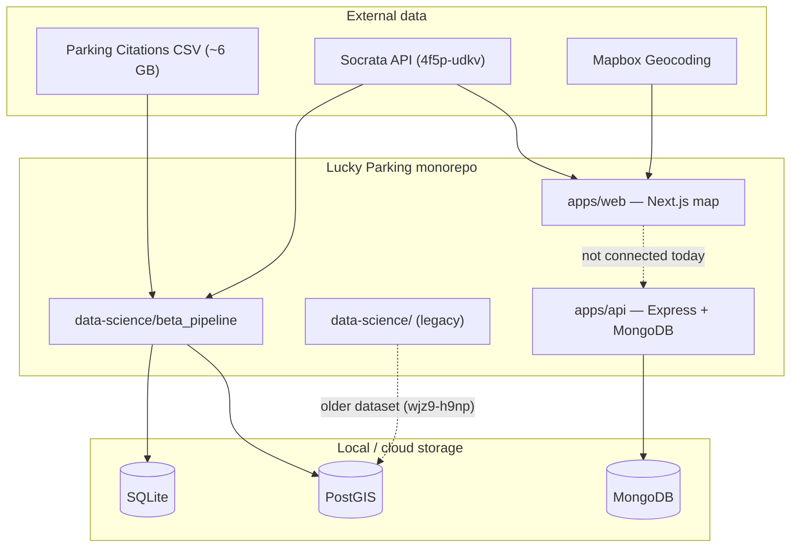

# Lucky Parking Documentation

Detailed project documentation for contributors, city planners, and developers. The project is **actively in development** — several components are implemented but not yet connected, and others are planned or stubbed.

## Start here

| Document | What you'll learn |
|----------|-------------------|
| [Overview](./01-overview.md) | Project mission, high-level architecture, and how the pieces relate |
| [Monorepo structure](./02-monorepo-structure.md) | Turborepo layout, packages, tooling, and local dev workflow |
| [Web application](./03-web-application.md) | Next.js map app, state, Socrata integration, components |
| [Backend API](./04-backend-api.md) | Express/MongoDB API — current status and contract |
| [Data pipeline (beta)](./05-data-pipeline.md) | Polars + SQLite/PostGIS ingestion, CLI, schemas |
| [Legacy data science](./06-legacy-data-science.md) | Older ETL, notebooks, and normalized PostGIS schema |
| [Data sources & schemas](./07-data-sources-and-schemas.md) | Dataset IDs, column dictionary, reference files |
| [Roadmap & open questions](./08-roadmap-and-open-questions.md) | Unfinished work, known gaps, and possible directions |

## Quick reference

## Related docs elsewhere in the repo

- [`data-science/beta_pipeline/README.md`](../data-science/beta_pipeline/README.md) — quick start for the Python pipeline
- [`data-science/beta_pipeline/ARCHITECTURE.md`](../data-science/beta_pipeline/ARCHITECTURE.md) — module-level code reference (complements [05-data-pipeline.md](./05-data-pipeline.md))
- [`CONTRIBUTING.md`](../CONTRIBUTING.md) — contribution and branching guidelines
- [`apps/api/src/docs/specs-v1.yaml`](../apps/api/src/docs/specs-v1.yaml) — OpenAPI spec for the citations API

## Documentation status

This documentation was written to reflect the repository as of mid-2026. Where behavior is uncertain or in flux, see [Roadmap & open questions](./08-roadmap-and-open-questions.md).
